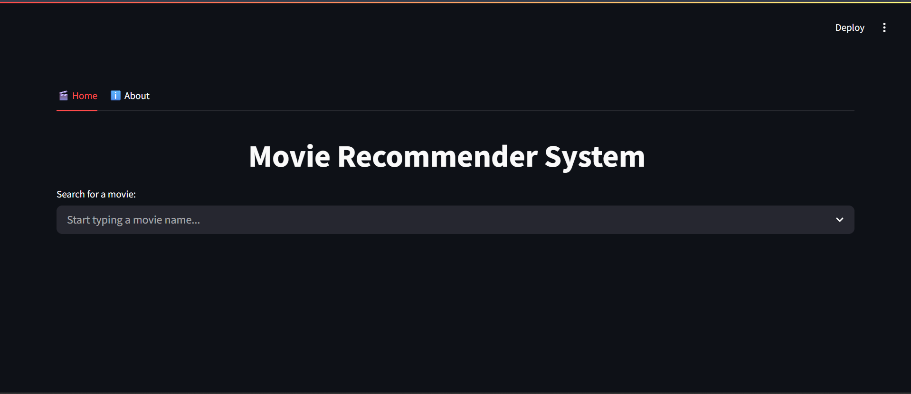

# 🎬 Movie Recommendation System  

A **content-based movie recommender system** that suggests similar movies based on features like **genres**, **keywords**, **cast**, and **crew**.  
Built with **Python**, **Scikit-learn**, and **Streamlit**, it provides personalized movie recommendations using **cosine similarity** and integrates with **The Movie Database (TMDB) API** for real-time movie posters, ratings, and descriptions.

---

## 📖 Table of Contents  

- [📌 Project Overview](#-project-overview)  
- [🧠 Key Features](#-key-features)  
- [🧰 Tech Stack](#-tech-stack)  
- [📂 Dataset](#-dataset)  
- [⚙️ Data Preprocessing](#️-data-preprocessing)  
- [💡 Model Logic](#-model-logic)  
- [💾 Model Storage](#-model-storage)  
- [🖥️ Streamlit Web App](#️-streamlit-web-app)  
- [🚀 How to Run the Project](#-how-to-run-the-project)  
- [🔑 TMDB API Setup](#-tmdb-api-setup)  
- [🧩 Example Output](#-example-output)  
- [📈 Future Improvements](#-future-improvements)  
- [👩‍💻 Developer](#-developer)  
- [📝 License](#-license)  
- [📦 Requirements](#-requirements)
---

## 📌 Project Overview  

This project demonstrates how **machine learning** and **natural language processing (NLP)** can be used to create a personalized movie recommendation engine.  
It analyzes metadata from the **TMDB 5000 Movies Dataset** and computes similarity scores using vectorized text features.

---

## 🧠 Key Features  

- 🎥 **Content-Based Filtering:** Recommends movies based on similarity of metadata.  
- 🧩 **Cosine Similarity:** Measures movie closeness using vectorized feature sets.  
- 🧠 **Text Preprocessing:** Includes stemming and feature concatenation for effective filtering.  
- 🌐 **TMDB API Integration:** Dynamically fetches posters, ratings, and descriptions.  
- 🧭 **Fuzzy Search:** Handles typos and partial matches efficiently.  
- 💡 **Interactive UI:** Streamlit-powered interface with modern dark theme.  
- 🌓 **Responsive Design:** Works seamlessly across devices.

---

## 🧰 Tech Stack  

| Category | Technology |
|-----------|-------------|
| **Language** | Python |
| **Libraries** | pandas, numpy, scikit-learn, nltk, ast, pickle, requests |
| **Frontend/UI** | Streamlit, HTML/CSS |
| **API** | The Movie Database (TMDB) API |
| **Utilities** | fuzzywuzzy |

---

## 📂 Dataset  

**Source:** [TMDB 5000 Movies Dataset (Kaggle)](https://www.kaggle.com/datasets/tmdb/tmdb-movie-metadata)

Contains:  
- `tmdb_5000_movies.csv` → Movie details, genres, and keywords  
- `tmdb_5000_credits.csv` → Cast and crew details  

---

## ⚙️ Data Preprocessing  

1. **Merge Datasets:** Combine `movies` and `credits` on the title column.  
2. **Select Columns:** Keep only relevant ones – `movie_id`, `title`, `overview`, `genres`, `keywords`, `cast`, and `crew`.  
3. **Handle Missing Values:** Remove null entries for cleaner training.  
4. **Convert JSON-like Strings:** Use `ast.literal_eval()` to extract nested data.  
5. **Feature Extraction:**  
   - Keep top 3 cast members.  
   - Extract the director name.  
   - Split overviews into token lists.  
6. **Data Cleaning:** Remove spaces, lowercase text, and apply stemming using `PorterStemmer`.  
7. **Tag Formation:** Merge all features (`overview`, `genres`, `keywords`, `cast`, `crew`) into one combined text field.  
8. **Vectorization:** Use `CountVectorizer(max_features=5000, stop_words='english')`.  
9. **Similarity Computation:** Compute **cosine similarity** between all movie vectors.

---

## 💡 Model Logic  

Each movie is represented as a **vector**. The system computes **cosine similarity** between the selected movie and all others, returning the **top 5 most similar** movies.

```python
def recommend(movie):
    movie_index = new_df[new_df['title'] == movie].index[0]
    distances = similarity[movie_index]
    movies_list = sorted(list(enumerate(distances)), reverse=True, key=lambda x: x[1])[1:6]
    for i in movies_list:
        print(new_df.iloc[i[0]].title)
```

## 💾 Model Storage
To reuse the model without retraining:
```python
pickle.dump(new_df.to_dict(), open('movie_dict.pkl','wb'))
pickle.dump(similarity, open('similarity.pkl','wb'))
```
These files store the movie metadata and similarity matrix for quick access.

## 🖥️ Streamlit Web App
A sleek, interactive web interface allows users to:
- Search for a movie
- View top 5 recommendations
- See movie posters, ratings, genres, and overviews

## 🧱 Interface Example
The app displays 5 recommended movies side by side with:
🎬 Poster
⭐ Rating
🎭 Genre tags
📝 Short overview
Each card is interactive and expands on hover.

## 🧩 Features
| Tab          | Description                                  |
| ------------ | -------------------------------------------- |
| 🎬 **Home**  | Search and view movie recommendations        |
| ℹ️ **About** | Learn about the system and technologies used |

## 🚀 How to Run the Project
1️⃣ Clone the repository
```bash
git clone https://github.com/<your-username>/movie-recommendation-system.git
cd movie-recommendation-system
```

2️⃣ Install dependencies
```bash
pip install -r requirements.txt
```

3️⃣ Add dataset files
Download and place tmdb_5000_movies.csv and tmdb_5000_credits.csv in the project folder.

4️⃣ Run preprocessing to generate model files
```bash
python model_training.py
```

5️⃣ Launch the Streamlit app
```bash
streamlit run app.py
```

## 🔑 TMDB API Setup

1. Create an account on TMDB
2. Go to Settings → API → Request an API Key.
3. Replace the placeholder in your code:
```python
API_KEY = "your_tmdb_api_key_here"
```

## 🧩 Example Output
Below are some snapshots of the Streamlit movie recommendation web app in action.
### 🎬 Home Page
Displays the search bar and movie input section.


### 🎞️ Recommendations Section
Shows top 5 similar movies with posters, ratings, and overviews.


## 📈 Future Improvements
- Add hybrid filtering (content + collaborative)
- Integrate user rating predictions using deep learning
- Display trailers and release year filters
- Deploy on Render or Streamlit Cloud for free hosting

## 👩‍💻 Developer
👩‍🎓 Jasreen 
🎓 B.Tech – Electronics & Communication Engineering (AI Specialization)
📊 Passionate about Data Analytics, NLP, and Software Engineering
🚀 Loves building AI-powered, user-friendly apps

## 📜 License
This project is licensed under the MIT License – feel free to use and modify with proper attribution.

## 📦 Requirements
- numpy
- pandas
- scikit-learn
- nltk
- streamlit
- requests
- fuzzywuzzy
- python-Levenshtein
- pickle-mixin
